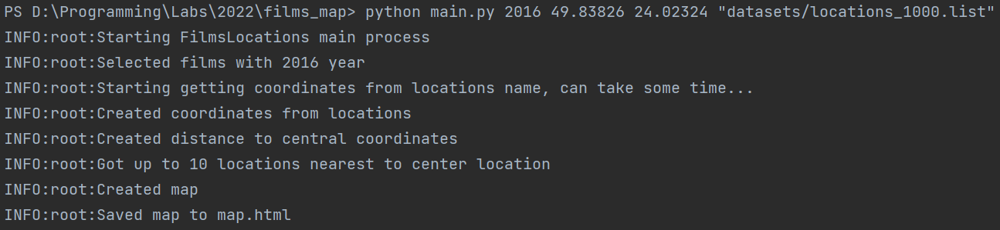
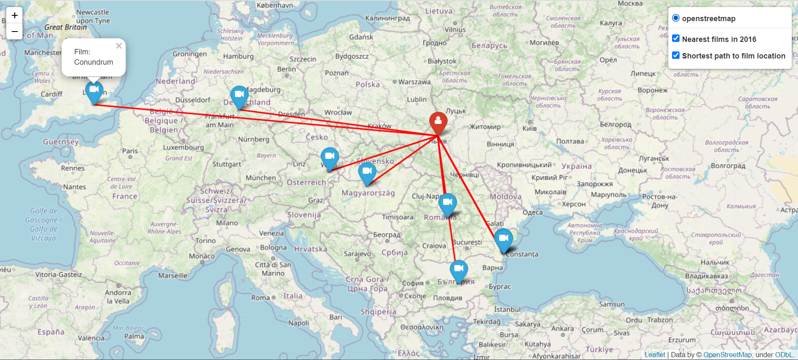

# Films map

Creates an html map with up to the 10 nearest films locations in a certain year by provided console input.
The web map shows information about the locations of films that were shot in a given year and the distance to them.

## Installation

Install the requirements:

```bash
pip install -r requirements.txt
```

## Usage

Call the module from the command line for movies for which year you want to build a map and your location as latitude and longitude (eg 49.83826,24.02324) and optionally the location of the file where you want to save the map. The result is an HTML file.

```bash
python main.py 2016 49.83826 24.02324 "datasets/locations_100.list" --save_map_to "map.html"
```

## Example


